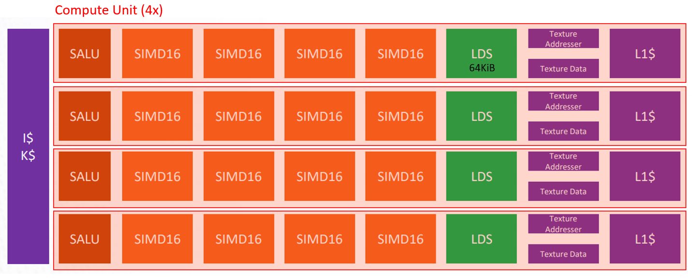
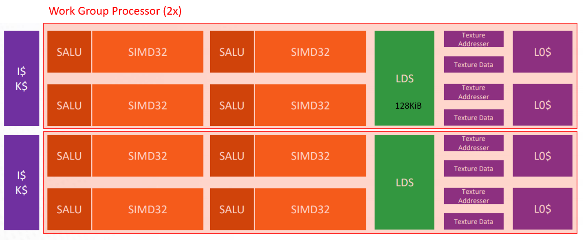
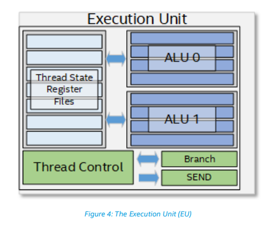
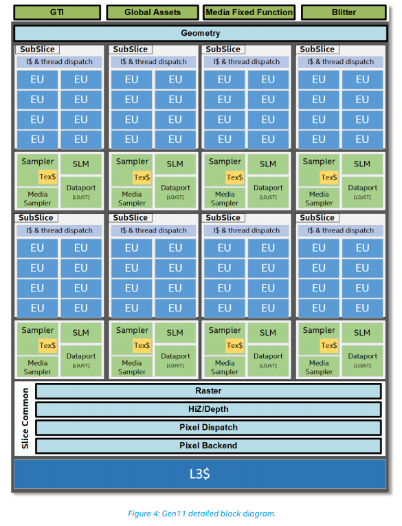
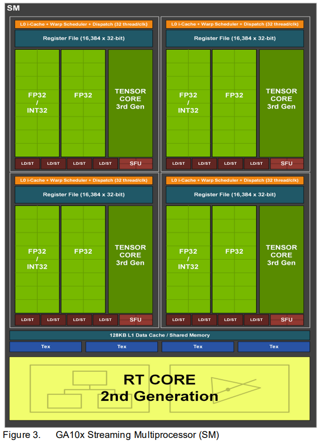

# Modern GPU Architectures <!-- omit in toc -->

GPU hardware vendors continually refine their microarchitectures and release improved product lineups. Oftentimes the changes in new architectures are incremental or scoped to a particular domain (e.g. ray tracing); however, having a general understanding of how different vendors implement the same concepts is definitely useful. These differences becomes important when you start to optimize compute shaders.

There is little point in dissecting every architecture in detail here since most vendor's publish comprehensive architecture whitepapers and optimization guides. This page will simply summarize the architectures that support DirectX 12, which limits the scope to hardware released around 2012 or later. I'll include an example GPU built on each architecture, its number of shader units, theoretical single-precision throughput (this is what most GPUs specialize in), and memory bandwidth numbers as a frame of reference; however, **keep in mind that two GPUs with the same numbers may perform *very* differently because of architectural differences.**

- [AMD](#amd)
  - [Compute Units (CUs)](#compute-units-cus)
  - [Workgroup Processors (WGP)](#workgroup-processors-wgp)
  - [Resources](#resources)
- [Intel](#intel)
  - [Execution Units (EU)](#execution-units-eu)
  - [Resources](#resources-1)
- [NVIDIA](#nvidia)
  - [Streaming Multiprocessors (SM)](#streaming-multiprocessors-sm)
  - [Tensor Cores](#tensor-cores)
  - [Resources](#resources-2)
- [Resources](#resources-3)

# AMD

[AMD](https://www.amd.com/en) is one of the largest vendors of discrete graphics cards. See [this page](https://en.wikipedia.org/wiki/List_of_AMD_graphics_processing_units) for a list of AMD GPUs.

| Year | Architecture | Example    | Example: Shader Units | Example: FP32 Throughput | Example: Bandwidth | Notable features for compute                          |
| ---- | ------------ | ---------- | --------------------- | ------------------------ | ------------------ | ----------------------------------------------------- |
| 2012 | GCN 1        | HD 7990    | 32 CU (2048 ALUs)     | 3.89 TFLOPS              | 288 GB/s           |                                                       |
| 2013 | GCN 2        | R9 390X    | 44 CU (2816 ALUs)     | 5.91 TFLOPS              | 384 GB/s           |                                                       |
| 2015 | GCN 3        | R9 Fury    | 56 CU (3584 ALUs)     | 7.17 TFLOPS              | 512 GB/s           | FP16 support, GPU preemption                          |
| 2016 | GCN 4        | RX 590     | 36 CU (2304 ALUs)     | 6.77 TFLOPS              | 256 GB/s           |                                                       |
| 2017 | GCN 5 (Vega) | Radeon VII | 60 CU (3840 ALUs)     | 11.14 TFLOPS             | 1024 GB/s          | 2x FP16 per SP (double throughput)                    |
| 2019 | RDNA 1       | RX 5700 XT | 20 WGP (2560 ALUs)    | 8.22 TFLOPS              | 448 GB/s           | WGPs double resources per thread group; Wave32/Wave64 |
| 2020 | RDNA 2       | RX 6900 XT | 40 WGP (5120 ALUs)    | 18.69 TFLOPS             | 512 GB/s           | Infinity cache                                        |

There are currently two main architectures that are relevant to DirectX 12: [Graphics Core Next](https://en.wikipedia.org/wiki/Graphics_Core_Next) (GCN) and [Radeon DNA](https://en.wikipedia.org/wiki/RDNA_(microarchitecture)) (RDNA).

## Compute Units (CUs)

In AMD's GCN architecture, a *shader unit* maps to a *compute unit* (CU). Each CU comprises:
- 4x 16-wide SIMD units. Instructions can be issued once per 4 cycles on these SIMDs.
- A 64 KiB of Local Data Share (LDS) (*thread group shared memory*).
- A scalar ALU (SALU) separate from the SIMD vector processors

## Workgroup Processors (WGP)

In AMD's RDNA architecture, a *shader unit* maps to a *work group processor* (WGP). Each WGP comprises:
- 2x CUs, which are now 2x 32-wide SIMD units. Instructions can be issued every cycle on these SIMDs.
- A 128 KiB of Local Data Share (LDS) (*thread group shared memory*).
- 4x scalar ALUs (SALU); one per CU.

## Resources

- [RDNA Whitepaper](https://www.amd.com/system/files/documents/rdna-whitepaper.pdf)
- [RDNA Architecture](https://gpuopen.com/wp-content/uploads/2019/08/RDNA_Architecture_public.pdf)
- [Optimizing for the RDNA Architecture](https://gpuopen.com/videos/optimizing-for-the-radeon-rdna-architecture/)
- [GCN: Optimizing GPU occupancy and resource usage with large thread groups](https://gpuopen.com/learn/optimizing-gpu-occupancy-resource-usage-large-thread-groups/)
- [An Architectural Deep-Device into AMD's GCN & RDNA](https://medium.com/high-tech-accessible/an-architectural-deep-dive-into-amds-terascale-gcn-rdna-gpu-architectures-c4a212d0eb9)
- [Vega Instruction Set Architecture](https://rocmdocs.amd.com/en/latest/GCN_ISA_Manuals/testdocbook.html)

# Intel

[Intel](https://www.intel.com/content/www/us/en/homepage.html) is well-known for CPUs, and most modern consumer CPUs incorporate integrated graphics processors. They are also starting to produce discrete graphics cards. See [this page](https://en.wikipedia.org/wiki/List_of_Intel_graphics_processing_units) for a list of Intel GPUs.

| Year | Architecture | Example                            | Example: Shader Units | Example: FP32 Throughput | Example: Bandwidth | Notable features for compute                   |
| ---- | ------------ | ---------------------------------- | --------------------- | ------------------------ | ------------------ | ---------------------------------------------- |
| 2013 | Gen7         | HD Graphics 4600 (Haswell GT2)     | 20 EU (160 ALUs)      | 0.35 TFLOPS              | 25.6 GB/s          |
| 2015 | Gen8         | HD Graphics 5600 (Broadwell GT2)   | 24 EU (192 ALUs)      | 0.40 TFLOPS              | 25.6 GB/s          |
| 2018 | Gen9         | UHD Graphics 630 (Coffee Lake GT2) | 24 EU (192 ALUs)      | 0.40 TFLOPS              | 42.7 GB/s          |
| 2019 | Gen11        | Iris Plus Graphics (Ice Lake GT2)  | 64 EU (512 ALUs)      | 1.08 TFLOPS              | 59.7 GB/s          |
| 2020 | Gen12        | Intel Xe MAX (DG1)                 | 96 EU (768 ALUs)      | 2.53 TFLOPS              | 68 GB/s            | Shared memory on subslice (no longer L3 cache) |

## Execution Units (EU)

With Intel graphics architectures, a *shader unit* maps an *Execution Unit* (EU).

Below is a diagram of Intel's Gen11 graphics architecture, which illustrates collections of EUs into groups known as *subslices*. Refer to the specific generation's architecture doc for specifics on the number of EUs and slices in a given graphics processor.

## Resources

- [Architecture Overview for Intel Processor Graphics Gen9](https://software.intel.com/content/dam/develop/external/us/en/documents/the-compute-architecture-of-intel-processor-graphics-gen9-v1d0.pdf)
- [Architecture Overview for Intel Processor Graphics Gen11](https://software.intel.com/content/www/us/en/develop/download/architecture-overview-for-intel-processor-graphics-gen11.html)
- [Developer and Optimization Guide for Intel Processor Graphics Gen11](https://software.intel.com/content/www/us/en/develop/articles/developer-and-optimization-guide-for-intel-processor-graphics-gen11-api.html)

# NVIDIA

[NVIDIA](https://www.nvidia.com/en-us/) is one of the largest vendors of discrete graphics cards. See [this page](https://en.wikipedia.org/wiki/List_of_Nvidia_graphics_processing_units) for a list of NVIDIA GPUs.

| Year | Architecture | Example   | Example: Shader Units | Example: FP32 Throughput | Example: Bandwidth | Notable features for compute                                                        |
| ---- | ------------ | --------- | --------------------- | ------------------------ | ------------------ | ----------------------------------------------------------------------------------- |
| 2010 | Fermi        | GTX 580   | 16 SM (512 ALUs)      | 1.58 TFLOPS              | 192 GB/s           |
| 2012 | Kepler       | GTX 780   | 12 SM (2304 ALUs)     | 3.98 TFLOPS              | 288 GB/s           |
| 2014 | Maxwell      | GTX 980   | 16 SM (2048 ALUs)     | 4.62 TFLOPS              | 224 GB/s           |
| 2016 | Pascal       | GTX 1080  | 20 SM (2560 ALUs)     | 8.23 TFLOPS              | 320 GB/s           | FP16 support (1:64 throughput of FP32 for consumer cards)                           |
| 2018 | Turing       | RTX 2080S | 48 SM (3072 ALUs)     | 10.14 TFLOPS             | 496 GB/s           | Tensor Cores, 2:1 throughput of FP32 for consumer cards, concurrent INT32/FP32 math |
| 2020 | Ampere       | RTX 3080  | 68 SM (8704 ALUs)     | 25.07 TFLOPS             | 760 GB/s           | bfloat16, TesorFloat-32 support                                                     |

## Streaming Multiprocessors (SM)

In all of NVIDIA's recent architectures, a *shader unit* maps to a *streaming multiprocessor* (SM). Unlike AMD compute units, however, the exact configuration of an SM changes every generation. You should refer to each architecture's design document for details. Later generations also incorporate new types of cores (tensor cores) that are complicated to summarize neatly in a table.

One thing that can be cleanly summarized is the number of dedicated single-precision FPUs in each SM by generation:

| Fermi | Kepler | Maxwell | Pascal | Turing | Ampere |
| ----- | ------ | ------- | ------ | ------ | ------ |
| 32    | 192    | 128     | 128    | 64     | 64     |

Below is a diagram of an SM from the Ampere architecture (specifically GA10x GPUs, which are found in the consumer-grade graphics cards).

## Tensor Cores

[Tensor cores](https://www.nvidia.com/en-us/data-center/tensor-cores/) are a unique unit in NVIDIA's latest architectures that accelerate specific types of matrix multiplications. These units offer exceptional throughput for certain AI applications, but unfortunately they're not accessible through HLSL at the moment; the only way we can leverage this hardware with DirectX is through metacommands.

## Resources

- [Ampere Architecture Whitepaper](https://www.nvidia.com/content/PDF/nvidia-ampere-ga-102-gpu-architecture-whitepaper-v2.pdf)
- [Turing Architecture Whitepaper](https://images.nvidia.com/aem-dam/en-zz/Solutions/design-visualization/technologies/turing-architecture/NVIDIA-Turing-Architecture-Whitepaper.pdf)
- [Programming Tensor Cores](https://developer.download.nvidia.com/video/gputechconf/gtc/2019/presentation/s9593-cutensor-high-performance-tensor-operations-in-cuda-v2.pdf)

# Resources

- [The GPU Database](https://db.thegpu.guru/). Amazing site for browsing AMD and NVIDIA graphics cards by architecture. Includes per-architecture diagrams of shader units (compute units), performance characteristics, references to ISA documentation, and more.
- [GPU Specs Database](https://www.techpowerup.com/gpu-specs/). Lists basic stats on GPUs from all vendors.