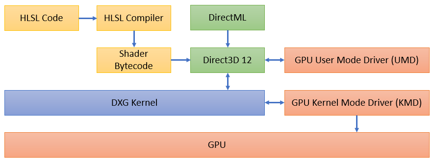
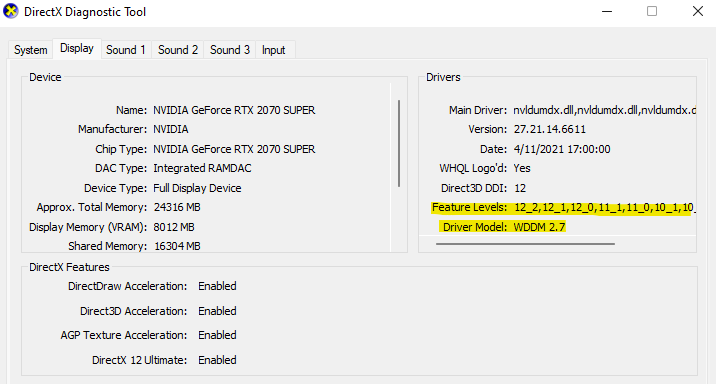

# An Overview of DirectX

DirectX is an umbrella term that refers to the graphics and compute platform that powers Windows, but it is sometimes used interchangeably with Direct3D (D3D). D3D is the primary API that developers use for launching graphics and compute workloads on GPUs, and D3D12 is the latest version of this API. D3D12 is considered an "expert-level" API: it provides a minimal abstraction over hardware (which is why you should be familiar with GPU programming and architectures first!) that yields a lot of control, but this control places a significant burden of responsibility on the programmer.

The best place to start is simply by reading through the [Direct3D 12 Programming Guide](https://docs.microsoft.com/en-us/windows/win32/direct3d12/directx-12-programming-guide). You may need to read this guide a few times over, and you really should experiment with the concepts in code samples. **The most critical concepts to learn for compute are pipeline state objects, memory management, resource binding, and work submission.** You should understand the concept of resource states, but you won't likely bother with a sophisticated scheme for state tracking. The rendering concepts are largely irrelevant here.

I won't attempt to duplicate any material here since there is so much of it line. However, I do want to provide a high-level map of the components that may be involved in a DX compute application:

- You as a developer provide code written in **high-level shading language (HLSL)** to implement some computation. 
- You'll convert the HLSL into bytecode using an **HLSL compiler**. [DXC](https://github.com/Microsoft/DirectXShaderCompiler) is the modern compiler, but the older [FXC](https://docs.microsoft.com/en-us/windows/win32/direct3dtools/fxc) is still available for older versions of HLSL (we'll cover this in more detail in another page on shader models). Shaders are compiled either at build time or runtime and handed to D3D for further compilation as a pipeline state object (PSO).
- **Direct3D** is at the heart of everything, and your application cannot send work to the GPU (using DirectX) without some D3D12 code at some level. You'll write D3D code to allocate resources on the GPU, create a command list, bind resources and execution state (i.e. your fully compiled shader), then dispatch the command list to the GPU.
- [DirectML](https://docs.microsoft.com/en-us/windows/win32/direct3d12/dml-intro) is a library of shader bytecode for implementations of machine learning operators. It also interfaces with D3D *[metacommands](https://docs.microsoft.com/en-us/windows/win32/direct3d12/dml-intro#why-does-directml-perform-so-well)* to tap into vendor-provided implementations of ML operators in some cases. The DirectML API uses D3D API objects as a currency (it's an extension of sorts) and you cannot use DML without writing D3D12 code.
- The hardware vendor provides **drivers** that implement the [Windows Display Driver Model](https://en.wikipedia.org/wiki/Windows_Display_Driver_Model) so that the GPU and DirectX platform can communicate with each other.

# Hardware Capabilities

DirectX supports a wide range of hardware, and not all hardware possesses the same level of functionality. DirectX provides several ways to inspect the capabilities of a GPU.

## D3D Feature Levels

[D3D feature levels](https://docs.microsoft.com/en-us/windows/win32/direct3d11/overviews-direct3d-11-devices-downlevel-intro) provide a way for the D3D API to expose sets of hardware capabilities so that developers don't have to check support for individual features on their GPU. A higher feature level represents a superset of functionality in the lower feature levels. D3D feature levels are useful to ensure a DX device meets some minimum functionality bar for an application, but some functionality simply isn't represented in D3D feature levels.

## D3D Feature Support

You will find that many features covered by D3D feature levels are related to rendering, so for compute applications you'll probably need to inspect individual features. The way to do this is with the [ID3D12Device::CheckFeatureSupport](https://docs.microsoft.com/en-us/windows/win32/api/d3d12/nf-d3d12-id3d12device-checkfeaturesupport) API. Your application can, at runtime, determine the functionality supported by the GPU and either fail upfront or provide appropriate fallback paths when required features don't exist.

## Driver Model & Version

The hardware vendor's drivers implement a specific version of the [WDDM](https://en.wikipedia.org/wiki/Windows_Display_Driver_Model), which in turn affects several of the features exposed through D3D. Ultimately, you need both recent drivers and a newer version of Windows to tap into the latest features. This is especially important with the redistributable version of Direct3D: even if you run the latest D3D with new drivers on an older version of Windows the kernel infrastructure may not exist to support features in the higher driver model.

Drivers also have their own version. Hardware vendors regularly release updated versions of their drivers to support new driver models, improve performance, and fix bugs.

## Shader Model

Finally, [shader models](https://github.com/microsoft/DirectXShaderCompiler/wiki/Shader-Model) express functionality specific to HLSL. You can check the hardware's highest supported shader model using D3D feature support checks at runtime. New shader models are typically introduced alongside new versions of the driver model: after all, drivers must be aware of how to handle changes to the shader bytecode that come with new shader functionality.

## DxDiag Tool

You can check your hardware's support using [DxDiag.exe](https://support.microsoft.com/en-us/windows/open-and-run-dxdiag-exe-dad7792c-2ad5-f6cd-5a37-bf92228dfd85). If you have multiple graphics cards in your machine you'll need to save the DxDiag information to a file to view all devices. 

# Learning Resources

- [Direct3D 12 Programming Guide](https://docs.microsoft.com/en-us/windows/win32/direct3d12/directx-12-programming-guide). The official programming guide and API reference. This should be the first place you go for learning the basics.
- [DirectX Landing Page](https://devblogs.microsoft.com/directx/landing-page/). Links to several DX resources.
- [DirectX Specs](https://github.com/microsoft/DirectX-Specs). Has both current and past specifications written by the DirectX team. This is an extremely useful resource for digging into details since not everything is documented in the API reference.
- [Introduction to DirectML](https://docs.microsoft.com/en-us/windows/win32/direct3d12/dml-intro)
- [DirectML on GitHub](https://github.com/microsoft/DirectML)
- [Microsoft DirectX 12 and Graphics Education](https://www.youtube.com/c/MicrosoftDirectX12andGraphicsEducation/playlists) is a YouTube channel managed by the DirectX team and has some great content. All of the content is worth watching if you have time, but for compute applications I recommend the deep dives in resources and binding:
  - [Heaps and Resources in DirectX 12](https://www.youtube.com/watch?v=fnYVSP9QgNM&list=PLeHvwXyqearWT_NT7CiGm_kEiKabWNPKw&index=3)
  - Resource Binding in DirectX 12: Part [1](https://www.youtube.com/watch?v=Uwhhdktaofg&list=PLeHvwXyqearWT_NT7CiGm_kEiKabWNPKw&index=4), [2](https://www.youtube.com/watch?v=Wbnw87tYqVg&list=PLeHvwXyqearWT_NT7CiGm_kEiKabWNPKw&index=5), and [3](https://www.youtube.com/watch?v=9YdIMYJ96Aw&list=PLeHvwXyqearWT_NT7CiGm_kEiKabWNPKw&index=6)
  - [Resource Barriers and You](https://www.youtube.com/watch?v=Db2TaG49SRg&list=PLeHvwXyqearWT_NT7CiGm_kEiKabWNPKw&index=18)
- [Jacque's Useful Links](https://devblogs.microsoft.com/directx/useful-links/)