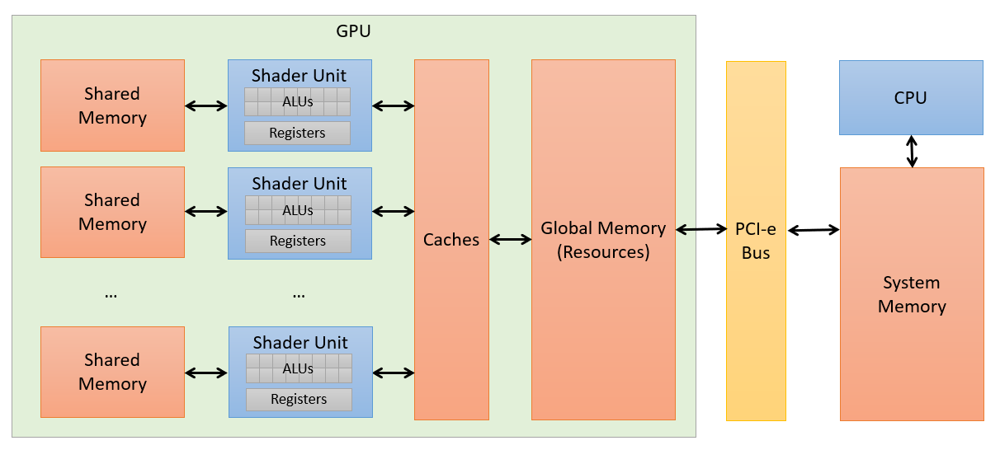

# GPU Programming Model <!-- omit in toc -->

This doc provides a whirlwind tour of how compute APIs work from a programmer's perspective. The basics covered here will be relevant if you're writing DX compute shaders, CUDA kernels, OpenCL kernels, Metal shaders, and so on.

- [Execution Model](#execution-model)
- [Simplified Hardware Model](#simplified-hardware-model)
  - [Shader Units](#shader-units)
  - [ALUs](#alus)
  - [Registers](#registers)
  - [Global Memory](#global-memory)
  - [Shared Memory](#shared-memory)
  - [Caches](#caches)
- [API Terminology](#api-terminology)
- [Resources](#resources)

# Execution Model

Regardless of which API you use for performing compute work on a GPU, the execution model is essentially the same. You'll often see it referred to as single instruction, multiple threads ([SIMT](https://en.wikipedia.org/wiki/Single_instruction,_multiple_threads)).

- The programmer writes some code, called a *compute shader* or *kernel*, that will be executed by many threads that run on the GPU. GPU threads are not like CPU threads: you may have several thousand GPU threads in flight simultaneously and they do not maintain their own program counter or state; threads *cannot* advance through a program independently! Each GPU thread has a unique thread ID that it can use to access different memory, for example, but all threads will ultimately be executing the same instructions. Since all threads execute the same instructions branching can be quite expensive: *all* branches that may be taken will be executed, with some threads simply being "deactivated" for branches they don't participate in. There are ways to mitigate this cost that will become clear later in the general optimizations page.

- When telling the GPU to execute a compute shader you do not simply launch (or *dispatch*) a number of GPU threads; instead, you dispatch *thread groups*. Each thread group has a maximum number of threads (typically 1024), so if you want to dispatch 3500 threads you'll need 4 thread groups. The grouping of threads is not an arbitrary restriction: it arises from hardware architectures. Threads share execution state so they should not be considered independent of on another. Thread groups encourage programmers to consider this reality and break their problems down into groups of threads that can communicate with each other and execute instructions. The size of these groups is limited, however, because hardware units have limited resources to store this state.

- A *thread group* is further broken down into one or more groups of related threads called *waves* or *warps*. This grouping again arises from hardware: all modern GPUs organize their ALUs into some number of SIMD processors. While the GPU programming model may make it seem like individual threads are scheduled (within a thread group), in reality the hardware schedules waves/warps within a thread group. The exact size of a wave is architecture-specific, but it's generally 16, 32, or 64 threads.

- Threads can coordinate with other threads in the same thread group using *barriers*, which are synchronization points that require all threads reach the same instruction before proceeding.

- No guarantee is made on the order in which thread groups execute within a dispatch. The implication here is that thread groups cannot synchronize with each other since it may result in a deadlock. You can, however, issue multiple dispatches if the problem cannot be efficiently solved with independent thread groups alone.

This execution model will make a little more sense when we look at how GPU hardware is configured in the next section.

# Simplified Hardware Model

The figure below illustrates a greatly simplified model of discrete GPU hardware. Some devices have a unified memory architecture (UMA) where the GPU and CPU share a single pool of memory, but we'll use a model below that more accurately reflects GPUs in dedicated graphics cards. Many details are excluded, but a simple model is sufficient to get started when programming basic compute shaders.

## Shader Units

This is a vendor-neutral term for a collection of ALUs, registers, and oftentimes memory and caches. Depending on the vendor and architecture there may be quite a bit more packed into one of these units. From a programmer's perspective, the defining feature is that chunks of work (thread groups) are scheduled on these units; in hardware it's really the waves of a thread group that are scheduled. To achieve good utilization of the hardware you must balance resource requirements of each thread group with what's available in the shader unit. The term *shader unit* is imperfect, but it captures the idea of a hardware unit that executes computer shaders. Vendor-specific terminology can change with each new architecture, so in the following sections I'll try to map vendor terminology back to this name.

## ALUs

An [arithmetic logic unit](https://en.wikipedia.org/wiki/Arithmetic_logic_unit), or ALU, is the piece of hardware that actually performs calculations like multiply and add. All modern GPUs group ALUs into SIMDs such that a single instruction will be executed on multiple data elements simultaneously; the granularity of these groupings differs quite a bit depending on the vendor and architecture. Consumer GPUs are heavily tailored to 32-bit ALUs and prioritize single-precision floating-point math or, more recently, half-precision floating-point and integer math. Consumer GPUs have a tiny fraction of ALUs that support double-precision math. Additionally, there may be some dedicated scalar ALUs such that instructions affecting only scalar variables (e.g. loop counters) can execute independently of other vectorized instructions.

## Registers

GPUs hide latency by scheduling lots of work: when a threads in a wave make a memory request it stalls and another wave can start executing. This context switch must be lightning fast, and we know memory access is slow in GPUs, so the execution state of a wave is preserved in registers. Consequently, shader units have large *register files* to store all this state. There's a limit, of course, and the more registers a compute shader requires the fewer waves can occupy a shader unit before exhausting the register file.

## Global Memory

Discrete GPUs have their own dedicated memory (sometimes called VRAM) separate from system memory (i.e. RAM). This is not low-latency memory by any measure, but compared to accessing system memory through the PCI-e bus it is extremely fast. For most compute programs you will first *upload* resources from the "host" (or CPU side / system memory) to the "device" (global memory) before initiating calculations; once the calculations are finished, you will then *download* (or readback) the resources from global memory into system memory if you need to access it on the CPU. Compute APIs like CUDA allow you to refer to global memory directly using pointers, but DirectX/HLSL does not support pointers in compute shaders: you must reference global memory through resource views.

## Shared Memory

Each shader unit may copy data from global memory into its own dedicated pool of memory called *shared memory* (called *thread group shared memory* in DirectCompute) for even faster access. The name of this memory implies its purpose: it's for sharing data between threads running on the same shader unit. This is the lowest-latency memory available aside from registers. As with registers, there is a limit to this resource: if your compute shader uses requires lots shared memory then it lowers the number of potential thread groups that can occupy the shader unit when a memory request results in a stall.

## Caches

As with CPUs there may be multiple levels of caches to reduce latency when fetching memory or instructions. However, unlike CPUs, GPU caches are generally much smaller. Some caches may be shared across all shader units (coherent) and others may not be. These caches are hardware architecture specific.

# API Terminology

Different compute APIs use different terms to refer to the same things, so the table below attempts to summarize this. I'll use DirectX terminology in most docs, but it's important to know the others (especially CUDA) as most learning resources will refer to these terms.

| DirectX                           | AMD/OpenCL        | NVIDIA/CUDA                   | Description                                                                                            |
| --------------------------------- | ----------------- | ----------------------------- | ------------------------------------------------------------------------------------------------------ |
| Dispatch                          | N-D range         | Grid                          | Collection of thread groups to dispatch on a GPU                                                       |
| Thread Group                      | Work Group        | Thread Block                  | Collection of threads that execute as a group on a CU/SM                                               |
| Thread                            | Work Item         | Thread                        | Smallest logical unit of work; analogous to a SIMD lane on CPU                                         |
| Wave                              | Wavefront         | Warp                          | Collection of threads that execute instructions simultaneously                                         |
| Compute Shader                    | Kernel            | Kernel                        | Function that each thread executes                                                                     |
| Shader Unit                       | Compute Unit (CU) | Streaming Multiprocessor (SM) | Collection of SIMD processors that executes a thread group                                             |
| Resources (Buffers, Textures)     | Global Memory     | Global Memory                 | Memory accessible to all thread groups                                                                 |
| Thread Group Shared Memory (TGSM) | Local Memory      | Shared Memory                 | Memory accessible to individual thread groups                                                          |
| Local Memory                      | Private Memory    | Local Memory                  | Memory private to each thread that doesn't fit in registers (essentially global memory; high latency!) |

# Resources

- [*Beginner*]: [**DirectCompute Lecture Series**](https://channel9.msdn.com/Tags/directcompute-lecture-series). A dated video series based on D3D11, but a decent intro if you're unfamiliar with GPU programming. One of the few resources that directly discusses DirectCompute. It's worth watching most of the videos in the series, but for learning the basics of DirectCompute these are the most useful:
  - [Series 101: Introduction to DirectCompute](https://channel9.msdn.com/Blogs/gclassy/DirectCompute-Lecture-Series-101-Introduction-to-DirectCompute). Covers the very basics. Ignore slides with D3D11 API calls -- it's not relevant to D3D12 -- but resources, resource views, HLSL, and compilation steps are all largely the same (though there is a newer compiler, dxc).
  - [Series 110: Memory Patterns](https://channel9.msdn.com/Blogs/gclassy/DirectCompute-Lecture-Series-110-Memory-Patterns). Covers resources and resource views in more depth, which are still relevant in D3D12, but ignore the specific API calls. HLSL examples still relevant.
  - [Series 210: GPU Optimizations and Performance](https://channel9.msdn.com/Blogs/gclassy/DirectCompute-Lecture-Series-210-GPU-Optimizations-and-Performance). Walk-through of some common optimizations using HLSL. Still highly relevant.

- **Matthäus G. Chajdas' compute shader series** is one of the best modern (written in 2018) overviews of GPU compute I've come across. I highly recommend reading at least the first post in this series after some beginner resources. The second and third posts are great when you have a little more experience.
  - [*Intermediate*]: [Introduction to computer shaders](https://anteru.net/blog/2018/intro-to-compute-shaders/). A more recent overview of the origin of compute shaders and how they related to graphics hardware. Start here if you're new to GPU programming!
  - [*Intermediate*]: [More compute shaders](https://anteru.net/blog/2018/more-compute-shaders/) (Matthäus G. Chajdas). Deeper inspection of latency hiding using AMD GCN architecture as an example.
  - [*Advanced*]: [Even more computer shaders](https://anteru.net/blog/2018/even-more-compute-shaders/)